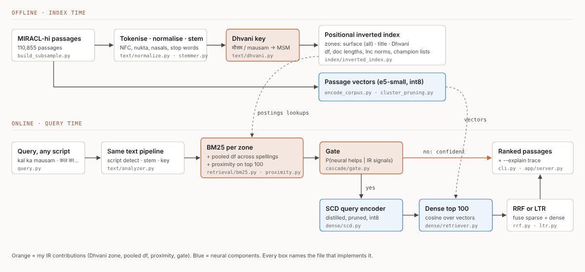

# LipiSetu: Script-Invariant Hindi Search

**CSD358 IR Hackathon · Track T5: Multilingual and Indic-language search**

Someone who types *"kal ka mausam"* should get the same results as someone who types *"कल का मौसम"*. On 350 judged MIRACL-Hindi queries, standard BM25 drops from nDCG@10 **0.533** (Devanagari) to **0.004** (same questions in Roman script), and the obvious fix, transliterating the query, only reaches **0.113**. I call this loss the **Script Gap**.

LipiSetu closes most of it with classic IR, all written from scratch:
- a cross-script phonetic key, the **Dhvani key** (मौसम / mausam / mosam → `MSM`), indexed as its own zone
- **pooled document frequency** across spellings, plus title zone and query-term proximity
- a small distilled neural encoder (448 MB → 37 MB) that runs **only when IR signals predict it will help**



## Results (dev, 350 queries × 3 scripts; latency on a laptop CPU, i5-12450H)

| System | nDCG@10 Devanagari | nDCG@10 Roman | nDCG@10 casual Roman | Script Gap (casual) | Consistency CSC@10 | Median ms |
|---|---|---|---|---|---|---|
| B1 BM25 + stemming | 0.533 | 0.004 | 0.003 | 0.530 | 0.179 | 0.7 |
| B2 transliterate + BM25 (obvious baseline) | 0.531 | 0.113 | 0.095 | 0.436 | 0.244 | 2.8 |
| S0 + classic Soundex zone | 0.518 | 0.344 | 0.320 | 0.198 | 0.534 | 11.3 |
| **S2 + Dhvani zone + pooled df** | 0.533 | 0.487 | 0.490 | **0.043** | **0.794** | 7.0 |
| D0 dense e5-small (int8) | 0.601 | 0.001 | 0.000 | 0.600 | 0.169 | 12.5 |
| D1 my SCD query encoder (37 MB) | 0.598 | 0.167 | 0.151 | 0.447 | 0.299 | 12.5 |
| **L1 learning to rank** | **0.642** | **0.501** | **0.498** | 0.143 | 0.637 | 35.5 |
| **G1 gated cascade** | 0.633 | 0.492 | 0.490 | 0.143 | 0.625 | 18.6 |

- The gate runs the neural stage for **36%** of queries and reaches nDCG@10 **0.538** over all forms, better than always-sparse (0.507) and always-neural (0.496).
- The base dense model matches **script before meaning**: for Roman queries it returns Roman-script passages (nDCG@10 0.001 and 0.000). Distillation fixes part of it; the Dhvani zone fixes more.
- Gains on Roman queries are significant (paired randomisation test, p < 0.001).

## Human query set (60 dev queries, typed by 3 team members)

| System | Devanagari | 3 human romanisations | Code-mixed | English |
|---|---|---|---|---|
| B1 BM25 + stemming | 0.571 | 0.013–0.020 | 0.033 | 0.015 |
| B2 transliterate + BM25 | 0.571 | 0.112–0.140 | 0.054 | 0.039 |
| **S3 LipiSetu sparse** | 0.616 | 0.435–0.448 | 0.204 | 0.119 |
| D1 SCD dense encoder | 0.595 | 0.179–0.208 | 0.316 | 0.413 |
| **L1 learning to rank** | 0.706 | 0.491–0.507 | 0.383 | 0.369 |
| G1 gated cascade | 0.691 | 0.434–0.454 | 0.260 | 0.258 |

- The three of us spelled a word identically only **78%** of the time, but our Dhvani keys agreed **91%** of the time.
- On real romanisations the synthetic results hold: S3 beats transliteration for every annotator (p ≤ 0.0002).
- **Limitation:** code-mixed and English queries need meaning, not sound (*leader* vs नेता). The sparse engine is weak there, the dense stage helps, and the gate (trained only on Devanagari and romanised queries) calls the dense stage too rarely for them.

Full tables: `results/` · report: [`docs/report/LipiSetu_report.pdf`](docs/report/LipiSetu_report.pdf).

## What works and what is planned

| Component | Status | Where |
|---|---|---|
| Data download + corpus subsample (MIRACL-hi, 110,855 passages) | ✅ | `scripts/download_data.py`, `scripts/build_subsample.py` |
| Normalisation, script-aware tokenizer, stop words, Hindi stemmer | ✅ | `src/lipisetu/text/` |
| Classic Soundex and the Dhvani key | ✅ | `text/soundex.py`, `text/dhvani.py` |
| Positional inverted index with zones, champion lists | ✅ | `src/lipisetu/index/` |
| Boolean (df-ordered, skip pointers), phrase queries, tf-idf lnc.ltc, BM25, proximity, heap top-K | ✅ | `src/lipisetu/retrieval/` |
| Pooled df across script variants | ✅ | `retrieval/bm25.py` |
| Synthetic query variants (standard and casual romanisation) | ✅ | `text/romanize.py`, `queries/` |
| Evaluation: nDCG, P@k, Recall, MRR, Script Gap, CSC (RBO), worst-script nDCG, significance | ✅ | `src/lipisetu/eval/`, `scripts/` |
| Dense retrieval (int8 ONNX), cluster pruning, RRF | ✅ | `src/lipisetu/dense/` |
| Script-consistency distillation + vocabulary pruning (448 MB → 37 MB) | ✅ | `dense/scd.py`, `scripts/train_scd.py` |
| Learning to rank, gated cascade | ✅ | `rerank/ltr.py`, `cascade/gate.py` |
| Command-line tool with `--explain`, web demo | ✅ | `src/lipisetu/cli.py`, `app/` |
| Human query set (3 annotators, 60 queries) + annotator agreement | ✅ | `queries/human/`, `scripts/annotator_agreement.py` |
| Neural transliteration baseline (IndicXlit), more languages, in-browser demo | ⏳ planned | roadmap in the report |

## Setup

Python 3.10–3.13, about 3 GB of disk. No GPU needed.

```bash
git clone https://github.com/devansh101005/IR-Hackathon.git
cd IR-Hackathon
python -m venv .venv
source .venv/bin/activate                  # Windows: .venv\Scripts\activate
pip install torch --index-url https://download.pytorch.org/whl/cpu    # small CPU-only torch
pip install -r requirements.txt
export PYTHONPATH=src                      # Windows PowerShell: $env:PYTHONPATH="src"
```

**Windows notes.** Set `$env:PYTHONUTF8="1"` too, so Hindi prints correctly. If Windows 11 *Smart App Control* blocks a scikit-learn DLL (`An Application Control policy has blocked this file`), install an older release that Windows already trusts: `pip install "scikit-learn==1.7.2"` (tested).

## Run

**Quick path (sparse system, about 5 minutes):**
```bash
python scripts/download_data.py                        # MIRACL-hi topics, qrels, corpus -> data/raw/
python scripts/build_subsample.py --size 100000 --seed 13
python scripts/make_variants.py                        # query forms, mixed corpus, annotation sheets
python scripts/build_index.py                          # -> indexes/main/   (about 2 min)
python -m lipisetu.cli search "kal ka mausam kaisa rahega" --explain
python -m lipisetu.cli compare "bharat ka samvidhan kab lagu hua" --systems B1,B2,S3
python -m lipisetu.cli boolean "भारत AND संविधान AND NOT नेपाल"
python -m lipisetu.cli phrase "भारत का संविधान"
```
`results/tuned_params.json` (tuned on the train split) is committed, so this works without re-tuning.

**Full path (neural parts, about 1.5 hours on a 4-core cloud CPU, 1h45m on an 8-core laptop):**
```bash
python scripts/build_index.py --mixed                  # mixed-script corpus for experiment E6
python scripts/tune_sparse.py                          # re-tune on train (optional, ~8 min)
python scripts/export_dense.py                         # e5-small -> ONNX fp32 + int8
python scripts/encode_corpus.py                        # passage vectors (~45 min)
python scripts/train_scd.py                            # distillation + pruning (~15 min)
python scripts/train_ltr_gate.py                       # learning to rank + gate (~5 min)
python app/server.py                                   # web demo at http://127.0.0.1:8000
```

## Reproduce every number

```bash
python scripts/run_all_eval.py           # main tables
python scripts/gate_budget_curve.py      # E10
python scripts/efficiency_experiments.py # E11
python scripts/pooled_df_experiment.py   # E6
python scripts/ablation_dhvani.py        # E5
python scripts/corpus_stats.py           # E3
python scripts/length_bias.py            # E13
python scripts/significance.py
python scripts/make_plots.py
python scripts/make_report.py            # docs/report/report.html (PDF: node scripts/print_pdf.js, or print from a browser)
pytest -q                                # 31 tests
```

## Data

- **MIRACL (Hindi)**: Wikipedia passages with human relevance judgments. Apache-2.0; text from Wikipedia (CC BY-SA). Test = dev split (350 queries), tuning/training = train split (1,169 queries) only.
- **Model**: `intfloat/multilingual-e5-small` (MIT).
- **Human query set**: romanised, code-mixed and English versions of 60 dev queries, written by my team (`queries/human/`).
- Credits and licences: [`docs/DATA.md`](docs/DATA.md). No web crawling, no personal data.

## Project documents

- [`PLAN.md`](PLAN.md): plan, novelty, rubric mapping
- [`docs/IR_CONCEPTS.md`](docs/IR_CONCEPTS.md): which IR principle lives where in the code
- [`docs/EVALUATION.md`](docs/EVALUATION.md): evaluation protocol, metrics, where each result lives
- [`docs/VIDEO_SCRIPT.md`](docs/VIDEO_SCRIPT.md) · [`docs/REPORT_OUTLINE.md`](docs/REPORT_OUTLINE.md)
- [`docs/WORK_DIVISION.md`](docs/WORK_DIVISION.md) · [`docs/AI_USE.md`](docs/AI_USE.md) · [`docs/QUERY_ANNOTATION_GUIDE.md`](docs/QUERY_ANNOTATION_GUIDE.md)

## Team

| Member | Roll no. | Owns |
|---|---|---|
| Devansh Pandey | 2310110461 | Idea and design; IR engine; Dhvani key and pooled df; dense retrieval, distillation, pruning, cluster pruning; learning to rank; gated cascade; evaluation; demo; report |
| Anamika Pal | 2310110037 | Human query annotation; annotator-agreement analysis |
| Abhinav Bachchas | 2310110383 | Human query annotation; final evaluation runs and plots |

## AI use

Declared in [`docs/AI_USE.md`](docs/AI_USE.md).
